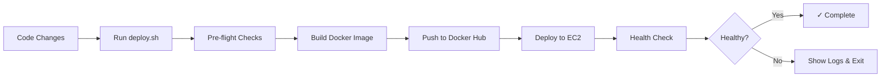

# VeriFact Complete Deployment System

Automated build and deployment pipeline for the VeriFact backend.

---

## 📦 What's Included

### 1. Deployment Script: `deploy.sh`

**Location:** `week-1/backend/deploy.sh`

Full end-to-end deployment automation:
- ✅ Builds multi-architecture Docker image
- ✅ Pushes to Docker Hub
- ✅ Deploys to EC2 with zero downtime
- ✅ Verifies health automatically
- ✅ Handles rollback scenarios
- ✅ Comprehensive error checking

### 2. Build Script: `build-and-push.sh`

**Location:** `week-1/backend/build-and-push.sh`

Docker image building only:
- ✅ Multi-arch builds (amd64 + arm64)
- ✅ Docker Hub push
- ✅ Dry-run support
- ✅ Buildx configuration

### 3. Comprehensive Documentation

- **[`DEPLOY_GUIDE.md`](DEPLOY_GUIDE.md)** - Complete deployment documentation
- **[`DEPLOYMENT_INFO.md`](../DEPLOYMENT_INFO.md)** - Infrastructure details
- **[`README.md`](README.md)** - Backend application guide

---

## 🚀 Quick Start

### Deploy Latest Code

```bash
cd /Users/apple/Developer//backend
./deploy.sh
```

### Test Build Only (No Deployment)

```bash
./deploy.sh --dry-run
```

### Build Docker Image Only

```bash
export DOCKER_USERNAME=gagan
export IMAGE_NAME=ai
./build-and-push.sh
```

---

## 📊 Deployment Workflow



---

## 🎯 Use Cases

### 1. Regular Deployment After Code Changes

```bash
# Edit your code
vim src/api/main.py

# Deploy
./deploy.sh
```

**What happens:**
1. Builds new Docker image with your changes
2. Pushes to Docker Hub
3. SSH into EC2
4. Pulls new image
5. Restarts backend container
6. Verifies deployment

**Time:** ~5-7 minutes

### 2. Emergency Rollback

```bash
# Deploy previous version
VERSION=v1.4.0 ./deploy.sh
```

### 3. Deploy to Different Environment

```bash
# Staging
EC2_HOST=staging-ip SSH_KEY=~/.ssh/staging-key.pem ./deploy.sh

# Production
EC2_HOST=prod-ip SSH_KEY=~/.ssh/prod-key.pem ./deploy.sh
```

### 4. Test Before Deploying

```bash
# Dry run
./deploy.sh --dry-run

# If successful, deploy
./deploy.sh
```

---

## 🔧 Configuration

### Default Values

All configurable via environment variables:

```bash
DOCKER_USERNAME=gagan           # Your Docker Hub username
IMAGE_NAME=ai    # Docker image name
VERSION=latest                        # Image tag
EC2_HOST=43.205.75.204               # EC2 instance IP
SSH_KEY=~/.ssh/verifact-key          # SSH private key path
SSH_USER=ec2-user                     # SSH username
```

### Override Examples

```bash
# Custom username and version
DOCKER_USERNAME=johndoe VERSION=v2.0.0 ./deploy.sh

# Different EC2 instance
EC2_HOST=52.1.2.3 SSH_KEY=/path/to/key.pem ./deploy.sh
```

---

## ✅ Safety Features

### 1. Pre-flight Checks

Before deployment, the script verifies:
- Docker is installed and running
- Dockerfile exists
- SSH key exists with correct permissions
- EC2 instance is reachable
- Docker Hub login is valid

### 2. Zero-Downtime Deployment

- New container starts before old one stops
- Health checks ensure service is ready
- Old container removed only after new one is healthy

### 3. Automatic Rollback Capability

If deployment fails:
- Health check detects issue
- Shows container logs
- Exits with error
- Previous version still accessible on Docker Hub

### 4. Dry-Run Mode

Test the entire build process without deploying:
```bash
./deploy.sh --dry-run
```

---

## 📋 Deployment Checklist

Before running `./deploy.sh`:

- [ ] Code changes tested locally
- [ ] Dependencies updated in `requirements.txt`
- [ ] Environment variables configured
- [ ] Docker is running
- [ ] SSH key is accessible
- [ ] EC2 instance is running
- [ ] Sufficient disk space on EC2

---

## 🐛 Common Issues & Solutions

### Issue: "Docker daemon is not running"

```bash
# Start Docker Desktop
open -a Docker

# Wait for Docker to start, then retry
./deploy.sh
```

### Issue: "SSH key not found"

```bash
# Verify key location
ls -la ~/.ssh/verifact-key

# Or specify custom location
SSH_KEY=/path/to/your/key.pem ./deploy.sh
```

### Issue: "Cannot connect to EC2"

```bash
# Check instance is running
aws ec2 describe-instances --instance-ids i-0a32d41f315ed7a4a --region ap-south-1

# Verify security group allows your IP
curl ifconfig.me

# Test SSH manually
ssh -i ~/.ssh/verifact-key ec2-user@43.205.75.204
```

### Issue: "Health check failed"

```bash
# Check backend logs
ssh -i ~/.ssh/verifact-key ec2-user@43.205.75.204 \
  'sudo docker logs verifact-backend --tail 50'

# Common causes:
# - Redis connection issues
# - API key problems
# - Port conflicts
```

---

## 📈 Performance

### Build Time

- **First build:** ~10-15 minutes (downloads base images)
- **Subsequent builds:** ~3-5 minutes (uses cache)
- **No code changes:** ~1-2 minutes (cache hits)

### Deployment Time

- **Docker pull:** ~30-60 seconds
- **Container restart:** ~10-20 seconds
- **Health check:** ~5-10 seconds
- **Total:** ~1-2 minutes

### Total End-to-End

**Average deployment:** ~5-7 minutes from code to production

---

## 🔐 Security Best Practices

### 1. SSH Key Protection

```bash
# Correct permissions
chmod 400 ~/.ssh/verifact-key

# Never commit to git
# (Already in .gitignore)
```

### 2. Environment-Specific Configurations

```bash
# Use different credentials per environment
export PROD_HOST=prod-ip
export STAGING_HOST=staging-ip

# Different keys
export PROD_KEY=~/.ssh/prod-key.pem
export STAGING_KEY=~/.ssh/staging-key.pem
```

### 3. Version Tagging

```bash
# Tag production releases
VERSION=v1.0.0 EC2_HOST=$PROD_HOST SSH_KEY=$PROD_KEY ./deploy.sh

# Use latest for development
./deploy.sh
```

---

## 📊 Monitoring

### During Deployment

```bash
# Watch logs in another terminal
ssh -i ~/.ssh/verifact-key ec2-user@43.205.75.204 \
  'cd /app && sudo docker logs -f verifact-backend'
```

### After Deployment

```bash
# Check status
ssh -i ~/.ssh/verifact-key ec2-user@43.205.75.204 \
  'cd /app && sudo docker-compose ps'

# Test API
curl http://43.205.75.204:8000/health

# Monitor resources
ssh -i ~/.ssh/verifact-key ec2-user@43.205.75.204 \
  'sudo docker stats --no-stream'
```

---

## 🔄 CI/CD Integration

The deployment script is designed for easy CI/CD integration:

### GitHub Actions Example

```yaml
name: Deploy to EC2

on:
  push:
    branches: [main]

jobs:
  deploy:
    runs-on: ubuntu-latest
    steps:
      - uses: actions/checkout@v2
      
      - name: Configure SSH
        run: |
          mkdir -p ~/.ssh
          echo "${{ secrets.EC2_SSH_KEY }}" > ~/.ssh/verifact-key
          chmod 400 ~/.ssh/verifact-key
      
      - name: Deploy
        env:
          DOCKER_USERNAME: ${{ secrets.DOCKER_USERNAME }}
        run: |
          cd week-1/backend
          echo "${{ secrets.DOCKER_PASSWORD }}" | docker login -u "$DOCKER_USERNAME" --password-stdin
          ./deploy.sh
```

---

## 💡 Tips & Tricks

### Create Deployment Aliases

Add to `~/.zshrc` or `~/.bashrc`:

```bash
alias vf-deploy='cd /Users/apple/Developer//backend && ./deploy.sh'
alias vf-deploy-dry='cd /Users/apple/Developer//backend && ./deploy.sh --dry-run'
alias vf-build='cd /Users/apple/Developer//backend && ./build-and-push.sh'
```

Then deploy from anywhere:
```bash
vf-deploy
```

### Deployment Notifications

```bash
# macOS notification
./deploy.sh && osascript -e 'display notification "Deployment successful" with title "VeriFact"'
```

---

## 📚 Related Documentation

- **[`DEPLOY_GUIDE.md`](DEPLOY_GUIDE.md)** - Complete deployment guide
- **[`../DEPLOYMENT_INFO.md`](../DEPLOYMENT_INFO.md)** - Infrastructure details
- **[`README.md`](README.md)** - Backend application guide
- **[`../infra/README.md`](../infra/README.md)** - Infrastructure setup

---

## 🆘 Getting Help

### Check Script Output

The script provides detailed, color-coded output:
- 🔵 Blue = Information
- 🟡 Yellow = Warnings
- 🟢 Green = Success
- 🔴 Red = Errors

### Enable Verbose Mode

For debugging, edit the script to add:
```bash
set -x  # Add after 'set -e' at the top
```

### Manual Deployment Steps

If automated deployment fails, you can deploy manually:

```bash
# 1. Build locally
docker build -t gagan/ai:latest .
docker push gagan/ai:latest

# 2. Deploy to EC2
ssh -i ~/.ssh/verifact-key ec2-user@43.205.75.204
cd /app
sudo docker pull gagan/ai:latest
sudo docker-compose up -d backend
```

---

**Last Updated:** February 15, 2026  
**Version:** 1.0.0  
**Maintained By:** CodeSurgeons Team
